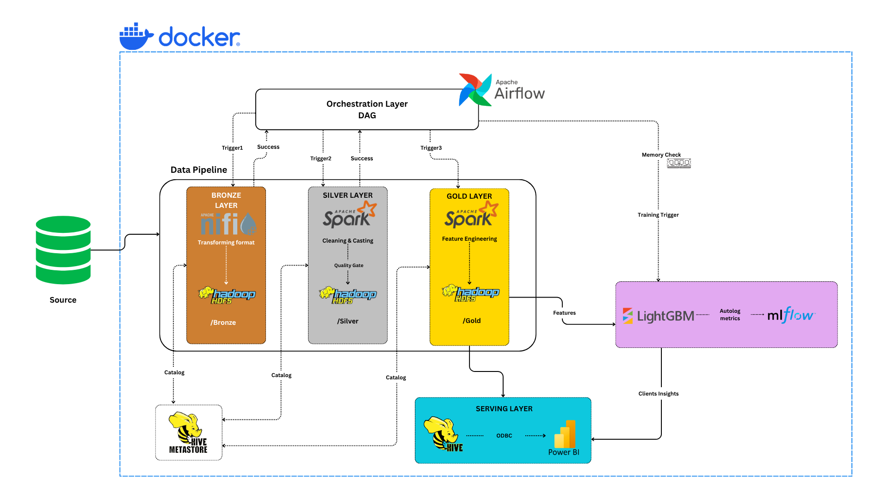
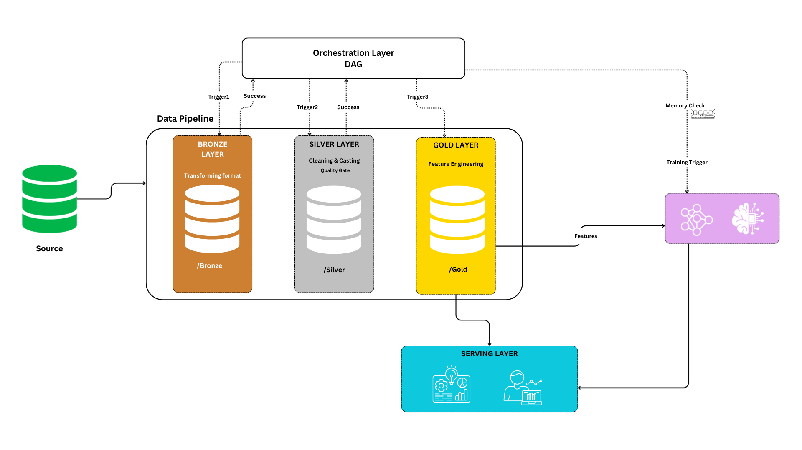
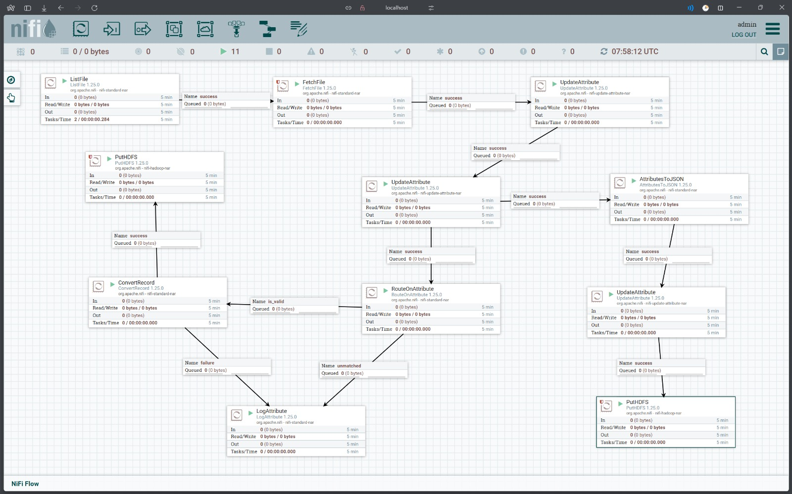
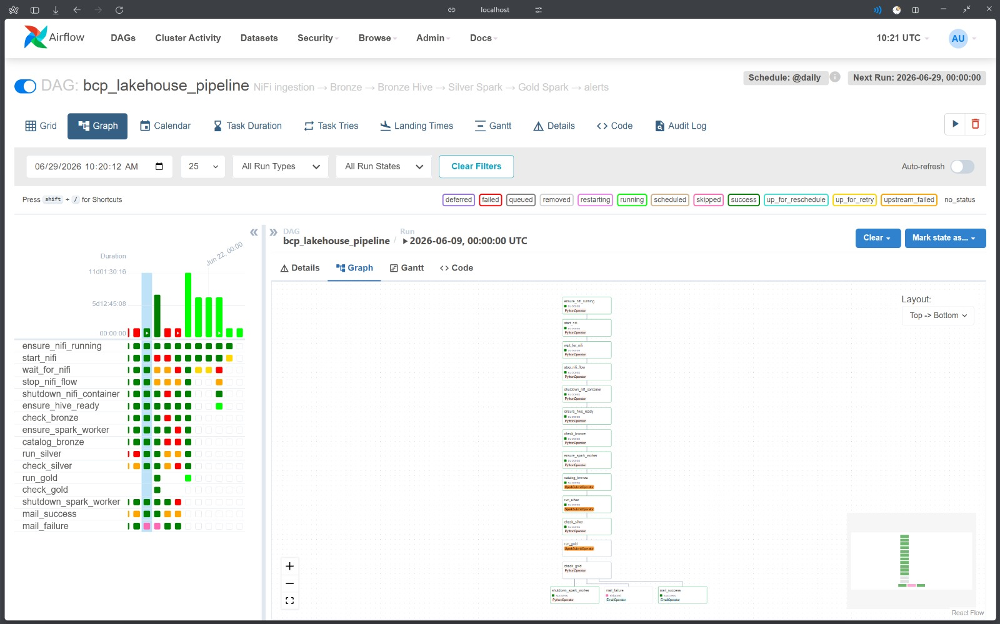

> [!WARNING]
> **SHOWCASE NOTICE** — This repository is a **sanitized, public showcase** of a real production data engineering system. All proprietary business logic, internal source-system names, credentials, and domain-specific data have been removed or replaced with generic equivalents. The code is shared for **educational and portfolio purposes only** and does **not** represent, expose, or reproduce any confidential information from the original implementation.

---

# Medallion Architecture Lakehouse — End-to-End Data Engineering Showcase

A fully containerized, production-inspired **Medallion Architecture** (Bronze → Silver → Gold) built entirely on open-source tooling. This showcase demonstrates how a modern data lakehouse can be orchestrated, catalogued, and served — from raw ingestion through ML feature engineering — on a single developer machine.



---

## Table of Contents

- [Overview](#overview)
- [Architecture](#architecture)
- [Key Engineering Achievements](#key-engineering-achievements)
- [Technology Stack](#technology-stack)
- [Repository Structure](#repository-structure)
- [Pipeline Walkthrough](#pipeline-walkthrough)
  - [Ingestion — Apache NiFi](#ingestion--apache-nifi)
  - [Orchestration — Apache Airflow](#orchestration--apache-airflow)
  - [Bronze Layer](#bronze-layer)
  - [Silver Layer](#silver-layer)
  - [Gold Layer & ML Features](#gold-layer--ml-features)
- [Getting Started](#getting-started)
- [Configuration](#configuration)
- [Testing](#testing)
- [Disclaimer](#disclaimer)

---

## Overview

This project implements a **complete batch data pipeline** for a financial services domain, specifically architected to power a distributed predictive savings system. Designed for high-volume batch processing, this architecture successfully ingested, harmonized, and transformed massive datasets to feed downstream machine learning models.

**Production Scale Highlights:**

- **Data Volume:** Engineered to process over **58 GB** of raw daily ingestion data.
- **Source Complexity:** Harmonized **47 distinct source files** with diverging schemas.
- **Throughput:** Processed and transformed over **one billion individual records** through the Medallion architecture.

The pipeline covers the following core concerns:

| Concern | Approach |
|---------|----------|
| **Ingestion** | Apache NiFi reads raw source files, converts them to Parquet, and lands them in HDFS |
| **Orchestration** | An Airflow DAG sequences every stage, manages container lifecycles, and sends email alerts |
| **Storage** | Hadoop HDFS as the distributed filesystem, with three warehouse zones (Bronze / Silver / Gold) |
| **Cataloguing** | Hive Metastore registers all layers as external tables, queryable via HiveServer2 / dbt / DBeaver |
| **Transformation** | PySpark jobs clean, cast, deduplicate, and feature-engineer across 15+ entity types |
| **ML Preparation** | The Gold master table is a single wide feature store consumed by training notebooks (LightGBM) |
| **Experiment Tracking** | MLflow logs model metrics and artefacts |
| **Serving** | HiveServer2 → ODBC → Power BI for business reporting |

> Everything runs locally inside **Docker Compose** — no cloud account required.

---

## Architecture

### Logical Data Flow



### Full Technology Stack


---

## Key Engineering Achievements

- **Distributed Processing at Scale:** Built resilient PySpark jobs capable of distributed joins and aggregations across 1 billion+ rows, utilizing partitioning and caching strategies to optimize Spark cluster memory.
- **Schema Evolution & Harmonization:** Developed a robust Silver layer config that dynamically merges up to 4 distinct Bronze tables per entity type (`allowMissingColumns=True`), standardizing complex and evolving financial data schemas.
- **Resource-Aware Orchestration:** Designed an Airflow DAG that programmatically manages Docker container lifecycles (spinning NiFi and Spark workers up and down via API), ensuring a massive data pipeline could execute reliably within a strict 12 GB local RAM envelope.
- **Automated Data Quality Gates:** Integrated automated verification tasks using the WebHDFS REST API to guarantee data integrity before allowing the pipeline to advance to the next Medallion layer.

---

## Technology Stack

| Layer | Technology | Version |
|-------|-----------|---------|
| Ingestion | Apache NiFi | 1.25.0 |
| Orchestration | Apache Airflow | 2.x (LocalExecutor) |
| Distributed Storage | Apache Hadoop HDFS | 3.2.1 |
| Processing (Bronze) | NiFi → Parquet | — |
| Processing (Silver / Gold) | Apache Spark (PySpark) | 3.5.3 |
| Schema Registry | Apache Hive Metastore | 2.3.2 |
| Query Engine | HiveServer2 | 2.3.2 |
| ML Training | LightGBM + scikit-learn | — |
| Experiment Tracking | MLflow | 2.12.1 |
| Serving / BI | Power BI (via ODBC / Hive JDBC) | — |
| Containerization | Docker Compose | — |
| Metastore Backend | PostgreSQL | 13 |
| Airflow Backend | PostgreSQL | 14 |

---

## Repository Structure

```
medallion-architecture-showcase/
├── airflow/
│   ├── dags/
│   │   └── main_orchestration_dag.py   # Master Airflow DAG
│   ├── Dockerfile
│   └── requirements.txt
├── spark/
│   └── jobs/
│       ├── bronze_catalog.py           # Hive table registration for Bronze
│       ├── silver_job.py               # Silver cleaning & casting
│       ├── gold_job.py                 # Gold feature engineering
│       └── notebooks/                  # ML training notebooks (outputs cleared)
├── hadoop/
│   ├── core-site.xml
│   ├── hdfs-site.xml
│   ├── hive-site.xml
│   └── hive-init.sh
├── nifi/
│   └── templates/                      # NiFi flow templates
├── tests/
│   ├── test_main_orchestration.py
│   ├── test_bronze_catalog.py
│   ├── test_silver_config.py
│   └── test_silver_job.py
├── images/                             # Screenshots & architecture diagrams
├── docker-compose.yml
└── requirements-test.txt
```

---

## Pipeline Walkthrough

### Ingestion — Apache NiFi

NiFi runs a multi-processor flow that:

1. **ListFile** — watches a mounted raw-data directory for new files
2. **FetchFile** + **ConvertRecord** — converts CSV/fixed-width input to Parquet
3. **RouteOnAttribute** — routes valid vs. invalid records to separate paths
4. **PutHDFS** — writes validated Parquet files under `/warehouse/bronze/<table_name>/`



The NiFi processor group is **started and stopped programmatically by Airflow** (via the NiPyAPI library), so the container only consumes memory during the ingestion window.

---

### Orchestration — Apache Airflow

The master DAG (`main_orchestration_dag.py`) sequences 15 tasks:

```
ensure_nifi_running
    → start_nifi → wait_for_nifi → stop_nifi_flow → shutdown_nifi_container
        → ensure_hive_ready → check_bronze → ensure_spark_worker
            → catalog_bronze → run_silver → check_silver
                → run_gold → check_gold
                    → shutdown_spark_worker
                    → mail_success / mail_failure
```

**Key design decisions:**

- **Container lifecycle management** — Airflow starts/stops the NiFi and Spark-Worker Docker containers on demand to stay within a 12 GB RAM envelope.
- **HDFS integrity checks** — `verify_hdfs()` calls the WebHDFS REST API to confirm file counts before advancing each stage.
- **Polling with stability detection** — `wait_for_nifi()` waits for the processor group to become idle for `N` consecutive poll rounds before proceeding, avoiding false-early-completions.
- **`ALL_DONE` trigger rules** — shutdown tasks always run even if upstream tasks fail, preventing container leaks.



---

### Bronze Layer

- **Who writes:** Apache NiFi → Parquet files directly onto HDFS
- **Who catalogs:** `bronze_catalog.py` (PySpark + Hive DDL)
- **What it does:**
  - Scans every subdirectory under `/warehouse/bronze/`
  - Infers the Parquet schema via `spark.read.parquet(glob)`
  - Registers each directory as a Hive `EXTERNAL TABLE STORED AS PARQUET`
  - Handles two NiFi layout variants: flat Parquet and Iceberg-style `data/` subdirectory

---

### Silver Layer

`silver_job.py` processes **15 entity types** (accounts, balances, cash flows, transactions, insurance, cards, digital products, etc.) using a shared config-driven pipeline:

1. **Multi-source union** — merges 2–4 Bronze tables per entity (with `allowMissingColumns=True` where schemas diverge across source extracts)
2. **Rename / coalesce** — harmonises column names across sources
3. **Type casting** — uses a per-table `casts` dict to enforce `int`, `double`, `date` types
4. **Normalisation** — fixes encoding variants in categorical fields
5. **Quality gate** — applies `not_null`, `non_negative`, and date-range filters
6. **Deduplication** — `dropDuplicates()` on configured key columns
7. **Write + Hive registration** — Parquet write to `/warehouse/silver/`, then `DROP + CREATE EXTERNAL TABLE` in Hive

All 15 silver tables are registered in the `silver` Hive database, making them immediately queryable via Beeline / dbt.

---

### Gold Layer & ML Features

`gold_job.py` performs **20 sequential steps** to produce a single wide feature table per customer entity:

| Steps | Description |
|-------|-------------|
| 1 | Load customer base (demographics, age computed from DOB) |
| 2 | Build binary classification labels from the insurance table |
| 3–17 | Aggregate one feature group per transaction type (balances, flows, ATM, POS, online, transfers, digital, cards, packs, deposits, vehicle-tax) |
| 18 | Left-join all feature DataFrames on the customer key |
| 19 | Compute derived scores: `savings_ratio`, `digital_score`, `spending_diversity`, `product_breadth`, `balance_trend`, `avg_monthly_spend` |
| 20 | Write master table to `/warehouse/gold/master_table` (8 Parquet partitions) |

The resulting Gold master table is partitioned for high-performance reads and serves as the direct input for LightGBM classification models. By consolidating complex transaction histories into derived behavioral scores (e.g., `savings_ratio`, `spending_diversity`), the pipeline bridges the gap between raw financial logs and actionable predictive analytics. Model metrics and artifacts are subsequently tracked using MLflow.

---

## Getting Started

### Prerequisites

- Docker Desktop (≥ 4.x) with at least **12 GB RAM** allocated
- Python 3.10+ (for running tests locally)

### 1. Clone & configure

```bash
git clone https://github.com/Rzn-Mohamed/medallion-architecture-showcase.git
cd medallion-architecture-showcase
cp .env.example .env        # fill in credentials — see Configuration below
```

### 2. Start the stack

```bash
docker compose up -d
```

Services and their UIs:

| Service | URL |
|---------|-----|
| Airflow | http://localhost:8081 |
| Spark Master | http://localhost:8080 |
| HDFS NameNode | http://localhost:9870 |
| NiFi | https://localhost:8443 |
| HiveServer2 UI | http://localhost:10002 |
| HiveServer2 JDBC | `jdbc:hive2://localhost:10000` |

### 3. Initialise Airflow

```bash
docker compose run --rm airflow-init
```

### 4. Trigger the pipeline

Enable and trigger the `lakehouse_pipeline` DAG from the Airflow UI, or via CLI:

```bash
docker compose exec airflow-webserver airflow dags trigger lakehouse_pipeline
```

---

## Configuration

All secrets are loaded from a `.env` file (never committed). Copy `.env.example` and fill in:

```env
# Airflow DB
AIRFLOW_DB_NAME=airflow
AIRFLOW_DB_USER=airflow
AIRFLOW_DB_PASSWORD=<choose>

# Airflow admin
AIRFLOW_ADMIN_USERNAME=admin
AIRFLOW_ADMIN_PASSWORD=<choose>
AIRFLOW_SECRET_KEY=<random-32-char-string>

# SMTP (for email alerts)
SMTP_HOST=smtp.gmail.com
SMTP_PORT=587
SMTP_USER=you@gmail.com
SMTP_PASSWORD=<app-password>
SMTP_MAIL_FROM=you@gmail.com
ALERT_EMAIL=you@gmail.com

# NiFi
NIFI_USERNAME=admin
NIFI_PASSWORD=<choose-12+-chars>
NIFI_API_URL=https://nifi:8443/nifi-api
NIFI_PROCESSOR_GROUP=INGESTION-GROUP

# Spark / HDFS / Hive
SPARK_MASTER_URL=spark://spark-master:7077
HDFS_NAMENODE=hdfs://namenode:9000
HIVE_METASTORE_URI=thrift://hive-metastore:9083
```

---

## Testing

The test suite covers the Airflow DAG helper functions (NiFi polling, HDFS verification, container lifecycle) and the Silver configuration. All tests use stubs — no live infrastructure required.

```bash
pip install -r requirements-test.txt
python -m pytest tests/ -v
```

---

## Disclaimer

> This repository is a **portfolio showcase** only. It is derived from a real production system but has been **fully sanitized**: all proprietary source-system names, internal table schemas, business-specific product identifiers, credentials, and any data that could identify the original organization or its clients have been removed or replaced with generic equivalents.
>
> The code is shared to demonstrate data engineering patterns and is **not intended for production use as-is**. No confidential information from the original implementation is present in this repository.